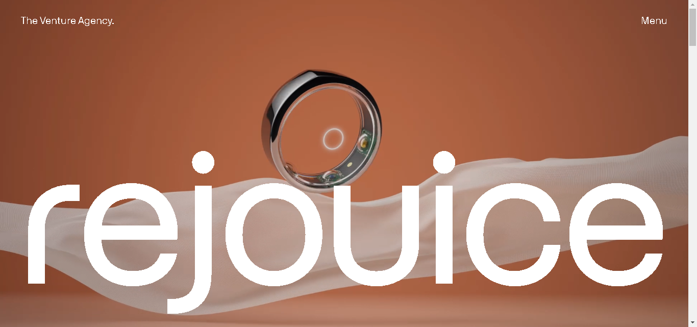

# Rejouice Clone

This project is a simple web page clone of Rejouice, featuring smooth sliding effects using the Swiper.js library and animation effects using the GSAP library.

[](./Home%20-%20REJOUICE®.mp4)


## Table of Contents

- [Demo](#demo)
- [Features](#features)
- [Installation](#installation)
- [Usage](#usage)
- [Technologies](#technologies)
- [Contributing](#contributing)
- [License](#license)

## Demo

You can check out the live demo [here](https://rejouice-clone.netlify.app/) (Deployed link).

## Features

- **Smooth Sliding Effect:** Utilizes the Swiper.js library to achieve a seamless sliding experience.
- **Animation Effects:** Incorporates GSAP library for engaging animation effects.

## Installation

1. Clone the repository:

   ```bash
   git clone https://github.com/ayeshasikander/Rejouice-clone.git
   ```

2. Change into the project directory:

   ```bash
   cd rejouice-clone
   ```

3. Open the `index.html` file in your preferred web browser or deploy the project on a web server.

## Usage

1. Open the `index.html` file in your web browser.
2. Explore the smooth sliding effects and animation features inspired by Rejouice.

## Technologies

- HTML
- CSS
- JavaScript
- [Swiper.js](https://swiperjs.com/) - for smooth sliding effects.
- [GSAP](https://greensock.com/gsap/) - for animation effects.

## Contributing

Feel free to contribute by opening issues, providing feedback, or submitting pull requests. Follow the [contribution guidelines](CONTRIBUTING.md) for more details.

## License

This project is licensed under the [MIT License](LICENSE).